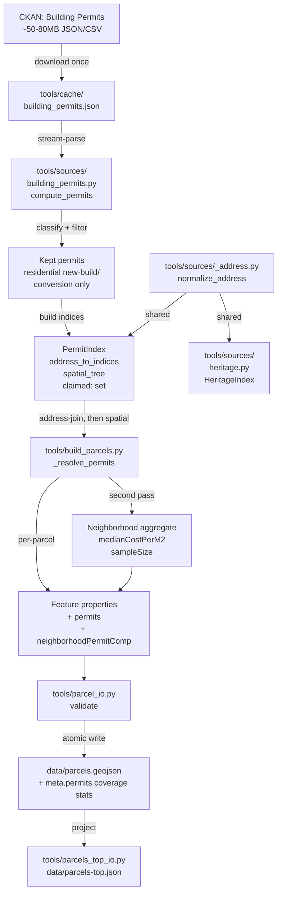

# Design Document

## Overview

The building-permits-source ETL adds a new source loader (`tools/sources/building_permits.py`) and two new wire-format fields (`properties.permits`, `properties.neighborhoodPermitComp`) plus a new metadata block (`meta.permits`) to BloomTO's parcel pipeline. The loader fetches Toronto Building Permits via CKAN, classifies each row to keep only residential new-build / conversion permits, and joins them to parcels in two stages: a deterministic normalized-address join first, with a point-in-parcel spatial fallback for permits whose addresses don't normalize. Per-parcel and per-neighborhood aggregates are computed with a 5-year freshness window and a 50M CAD per-permit sanity ceiling.

This is an **ETL-only feature**. Nothing in this design touches `index.html`, `goldmines.html`, `parcels.html`, or `geocode-proxy.php`. The browser-rendered surface is unaffected; the data simply gains new keys that downstream specs can consume.

## Steering Document Alignment

### Technical Standards (CLAUDE.md as the steering source)

CLAUDE.md frames v1.2 as a "parcel-level Multiplex Readiness view for developers" and explicitly retires Deck.gl, MapLibre, browser Parquet/DuckDB, WordPress blocks, and any non-`geocode-proxy.php` PHP file. This design honors all four:

- **No new PHP files.** The loader is pure Python in `tools/sources/`.
- **No new browser libraries.** The wire format expands; the rendering path doesn't change.
- **No 3D in the browser.** Permits are tabular `(string, number, date)` records; nothing geometric crosses the wire.
- **No bundler / npm install / build step.** Standalone Python module added under existing `tools/requirements.txt` deps.

### Project Structure (existing `tools/` layout)

The new module slots into the existing `tools/sources/` convention next to `heritage.py`, `zoning.py`, `solar_to.py`, etc. Each source loader exposes a `compute_*(cache_dir)` factory returning an indexable bundle (`HeritageIndex`, here `PermitIndex`). The orchestrator (`tools/build_parcels.py`) imports and consumes those factories. Nothing about that layout changes.

The shared address normalizer (`normalize_address` + `STREET_TYPE_ABBREVIATIONS`) is being lifted out of `heritage.py` into a new `tools/sources/_address.py` so both sources import a single source of truth — the underscore-prefixed name signals "internal sources helper, not a top-level loader."

## Code Reuse Analysis

### Existing Components to Leverage

- **`tools/sources/heritage.py:normalize_address`** — relocated to `tools/sources/_address.py` (Component 1 below); both heritage and permits import it. Same closed-set street-type abbreviations, same uppercase + token-replace pipeline. No regex (NFR Performance).
- **`tools/sources/heritage.py:_ensure_cached` pattern** — lifted as the model for `building_permits.py:_ensure_cached`. One-shot download into `tools/cache/`, reuse on subsequent runs, atomic-replace on partial download.
- **`tools/sources/zoning.py:iter_parcels` ijson streaming pattern** — Toronto's permit feed will arrive as either CSV or JSON-array; for the JSON case, `ijson.items(fp, "result.records.item")` mirrors the streaming behavior. CSV uses `csv.DictReader` directly (already imported elsewhere).
- **`tools/sources/heritage.py:HeritageIndex` two-stage join contract** — `PermitIndex` follows the same shape: address-join dict + STRtree + a claimed-indices set. `build_parcels.py` already implements the address-first / spatial-fallback orchestration for heritage (`_resolve_heritage_status`); `_resolve_permits` is a near-clone.
- **`tools/parcel_io.py:validate` and `FEATURE_PROPERTIES` / `META_KEYS` / `REQUIRED_STATS_KEYS`** — extended in place. Loud-failure pattern carries through.
- **`tools.sources._http.download_with_retries`** — already used by heritage for downloading from CKAN (`from . import _http`); reused verbatim.
- **`statistics.median`** — stdlib, no new dep.

### Integration Points

- **`tools/build_parcels.py`** — gains a `compute_permits(cache)` call alongside the existing `compute_heritage(cache)` call, a `_resolve_permits(parcel, permit_index)` helper mirroring `_resolve_heritage_status`, a per-parcel `permits` dict in the feature `properties`, and a post-loop second pass over completed features that computes `medianCostPerM2` per neighborhood and stamps `neighborhoodPermitComp` onto each parcel.
- **`tools/parcel_io.py`** — `FEATURE_PROPERTIES` grows `permits` and `neighborhoodPermitComp`; `META_KEYS` grows `permits`. `validate()` gets new key-presence checks and the `joinedByAddress + joinedBySpatialFallback + unjoined == totalPermitsKept` invariant.
- **`tools/parcels_top_io.py`** — `ROW_KEYS` grows `permits` and `neighborhoodPermitComp` so the goldmines/parcels pages can consume them when downstream specs surface them.
- **`tools/sources/heritage.py`** — single change: `from ._address import normalize_address, STREET_TYPE_ABBREVIATIONS` replacing the inline definitions. Heritage tests continue to pass because the function is byte-identical.

## Architecture



The dotted contract:

1. **Load + classify + filter** happens once at startup (Component 2).
2. **Index build** happens once at startup, after filtering (Component 2).
3. **Per-parcel join** happens inside the existing parcel-iteration loop (Component 4 — orchestrator change).
4. **Per-neighborhood aggregate** happens after the parcel loop, in a second pass that walks the now-final feature list, groups by `properties.neighborhood`, and stamps `neighborhoodPermitComp` (Component 4 again).
5. **Validate + atomic write** is the existing pipeline; only the validator's required-key sets grow (Component 5).

## Components and Interfaces

### Component 1: `tools/sources/_address.py` (new — refactor)

- **Purpose:** Single source of truth for cross-source address normalization.
- **Interfaces:**
  - `STREET_TYPE_ABBREVIATIONS: dict[str, str]` (closed set; tokens not in the dict pass through unchanged after uppercasing).
  - `normalize_address(text: str) -> str` (uppercases, splits on whitespace, replaces street-type tokens, rejoins).
- **Dependencies:** stdlib only.
- **Reuses:** Lifted byte-identical from `heritage.py:normalize_address`. The original constants and function move; the original location becomes `from ._address import ...`.

This is a pure refactor — no behavior change. The validator-suggested decoupling (Req 4.2) is the entire reason for splitting it out: a future heritage-only fix to one of the abbreviation entries would otherwise silently change permit join behavior. With the shared module, both consumers move together by design.

**Scope of the move (do NOT over-extract).** Only `STREET_TYPE_ABBREVIATIONS` and `normalize_address` move. The heritage-specific helpers `KNOWN_STATUSES`, `STATUS_PRECEDENCE`, and `more_restrictive` STAY in `heritage.py` — they are heritage-domain logic and have no analog in permits. The `_address.py` module is intentionally minimal so a future third source (e.g. parking, water-service) can import it without inheriting heritage semantics.

### Component 2: `tools/sources/building_permits.py` (new)

- **Purpose:** Load Toronto Building Permits, classify, filter to residential new-build/conversion, and produce a `PermitIndex` for the orchestrator.
- **Interfaces:**
  - `BuildingPermit` dataclass (frozen): `permit_id: str`, `address: str` (raw), `lat: float | None`, `lng: float | None`, `permit_type: str`, `description: str` (classifier-only), `declared_value_cad: int`, `issued_date: date`, `unit_count: int | None`, `floor_area_m2: float | None`.
  - `PermitIndex` `NamedTuple` (matches the `HeritageIndex` shape in `heritage.py`): `permits: list[BuildingPermit]`, `address_to_indices: dict[str, list[int]]`, `spatial_tree: STRtree`, `centroids: list[Point | None]` (1:1 with `permits`; `None` when upstream geom missing), `claimed: set[int]` (the SET ITSELF is mutable across join phases — NamedTuple immutability binds the field reference, not the set's contents — same pattern as a NamedTuple holding a list).
  - `compute_permits(cache_dir: Path, freshness_years: int = 5, sanity_ceiling_cad: int = 50_000_000) -> PermitIndex`.
  - `classify(permit_type: str, description: str) -> str | None` — the classifier function. Two-stage logic: (1) consult `PERMIT_CATEGORY_TABLE.get(permit_type.upper().strip())` for a coarse category; (2) if the type maps to an ambiguous bucket like `"addition"`, refine via `_DESCRIPTION_KEYWORDS` (a list of `(category, keyword_re_or_substring)` rules — checked in order, first match wins) to disambiguate "addition with new units" vs "addition (renovation only)". Returns the final category string, or `None` for unclassified.
  - Module constants: `DEFAULT_FRESHNESS_YEARS = 5`, `SANITY_VALUE_CEILING_CAD = 50_000_000`, `MAX_UNCLASSIFIED = 1000`, `MIN_NEIGHBORHOOD_SAMPLE_SIZE = 10`.
  - `PERMIT_CATEGORY_TABLE: dict[str, str]` — closed-set classifier mapping keyed on uppercased upstream `permit_type`. The single tuning surface for type-level classification.
  - `_DESCRIPTION_KEYWORDS: list[tuple[str, str]]` — disambiguation rules consulted only when `PERMIT_CATEGORY_TABLE` returns an ambiguous bucket. Substring-match (no regex per Performance NFR), first hit wins. Default-deny: a row that hits the ambiguous bucket but matches no keyword is left with the coarse category.
  - `KEPT_CATEGORIES: frozenset[str]` = `{"new_residential", "conversion", "addition_with_units"}`.
  - `class ClassifierDriftError(RuntimeError)`.
- **Dependencies:** `csv`/`ijson`/`json`, `shapely.STRtree`, `shapely.geometry.Point`, `tools.sources._http` (relative `from . import _http`), `tools.sources._address.normalize_address`, `datetime.date`.
- **Reuses:** Mirrors `heritage.py` for `_ensure_cached`, `_iter_records`, the `compute_*` factory, and the dataclass-bundle return shape. Mirrors `zoning.py` for ijson streaming.

The classifier path:

```
upstream permit_type → PERMIT_CATEGORY_TABLE → category string
  → in KEPT_CATEGORIES?  yes → keep, build index
                         no  → drop, increment skipped_<reason>
  → unmapped?            → drop, WARN-once-per-value, increment skipped_unclassified_type
                           if skipped_unclassified_type > MAX_UNCLASSIFIED → raise ClassifierDriftError
```

The keep path:

```
keep candidate → declared_value_cad valid (>0)?  no  → skipped_bad_value
                                                 yes → continue
              → declared_value_cad <= sanity?    no  → skipped_outlier_value
                                                 yes → continue
              → issued_date parseable?           no  → skipped_bad_date
                                                 yes → BuildingPermit constructed
```

After all rows iterated, a single index-build pass:

- Assign `i = len(permits)`, append to `permits`.
- If `normalize_address(raw)` non-empty → `address_to_indices.setdefault(normalized, []).append(i)`.
- If `lat` and `lng` valid → append `Point(lng, lat)` to `centroids`.
- After loop, `spatial_tree = STRtree(centroids)`.
- `claimed = set()`.

### Component 3: `tools/sources/heritage.py` (refactor)

- **Purpose:** Unchanged. Behavior preserved, imports updated.
- **Interfaces:** `compute_heritage`, `HeritageIndex`, `more_restrictive` — all unchanged.
- **Dependencies:** `from ._address import normalize_address, STREET_TYPE_ABBREVIATIONS` replaces the inline declarations.
- **Reuses:** itself, byte-equivalent.

### Component 4: `tools/build_parcels.py` (orchestrator extension)

- **Purpose:** Drive the new join, aggregate, and stamp permit fields onto features.
- **Interfaces:** Internal — no public-API change. New helpers:
  - `_resolve_permits(parcel, permit_index) -> tuple[list[int], str]` returns the list of permit indices claimed for this parcel AND the `denominatorSource` label. Runs BOTH phases unconditionally (not "spatial only when address missed") so the `"mixed"` enum value is reachable per Req 6.5: phase 1 claims any address-join hits and tracks `addr_count`; phase 2 then walks the STRtree and claims any unclaimed-and-contained permit centroids, tracking `spatial_count`. Label = `"address_join"` if `addr_count > 0 and spatial_count == 0`, `"spatial_fallback"` if `addr_count == 0 and spatial_count > 0`, `"mixed"` if both > 0, `"no_joined_permits"` otherwise. Mutates `permit_index.claimed` once per claim.
  - `_aggregate_parcel_permits(indices, permits, freshness_cutoff_date, denom_source) -> dict` returns the per-parcel `permits` shape (recentCount, recentValueTotal, recentMostRecentDate, denominatorSource). When `recentCount == 0` (every joined permit was older than the freshness window, or no permits joined) the `denominatorSource` is rewritten to `"no_joined_permits"` regardless of the input label, matching the validator invariant in Component 5.
  - `_compute_neighborhood_perm_comp(claims_by_neighborhood, freshness_cutoff_date, freshness_years, min_sample_size) -> dict[str, dict]` reads a per-neighborhood lookup of joined permit indices (built during the parcel loop — see "Stash mechanism" below), groups them, computes the median of `declared_value_cad / floor_area_m2` for permits with `floor_area_m2 > 0` and `issued_date >= freshness_cutoff_date`, and returns `{neighborhood_name: {medianCostPerM2, sampleSize, freshnessYears}}`. **No per-record per-m² sanity band is applied** (per Req 7.4a — median is robust; a band would only mask classifier-drift schema bugs we want to surface). Logs the Req 5.5 join-phase summary line `permits joined: <addr_count> by address, <spatial_count> by spatial fallback, <unjoined> unjoined` once at the end of the second pass.
- **Dependencies:** `tools.sources.building_permits.compute_permits`, `statistics.median`.
- **Reuses:** The existing parcel-iteration loop, the existing heritage-resolution pattern (`_resolve_heritage_status`), the existing two-stage iteration order. The new code is grafted onto the same loop without restructuring.

**Stash mechanism for the second pass.** During the parcel loop, the orchestrator maintains two parallel structures:

- `parcel_permits_by_feat_idx: dict[int, dict]` — keyed by the position the feature WILL OCCUPY in the final `features` list (i.e. `len(features)` at the moment the feature is appended). Holds the per-parcel `permits` dict computed by `_aggregate_parcel_permits`. The second pass uses `enumerate(features)` to retrieve.
- `claims_by_neighborhood: dict[str, list[int]]` — appended to each time `_resolve_permits` claims one or more permits. Keyed by `nb.name`; values are flat lists of permit indices. This is what `_compute_neighborhood_perm_comp` consumes — no need for it to walk `features` or re-resolve.

The orchestrator's per-parcel block (in pseudocode):

```python
permit_indices, denom_source = _resolve_permits(parcel, permit_index)
parcel_permits = _aggregate_parcel_permits(
    permit_indices, permit_index.permits, freshness_cutoff_date, denom_source,
)
feat_idx = len(features)
parcel_permits_by_feat_idx[feat_idx] = parcel_permits
claims_by_neighborhood.setdefault(nb.name, []).extend(permit_indices)
features.append(feature)

# ...after the parcel loop, second pass:
nb_comp = _compute_neighborhood_perm_comp(
    claims_by_neighborhood, freshness_cutoff_date,
    freshness_years=freshness_years, min_sample_size=MIN_NEIGHBORHOOD_SAMPLE_SIZE,
)
for feat_idx, feat in enumerate(features):
    feat["properties"]["permits"] = parcel_permits_by_feat_idx[feat_idx]
    feat["properties"]["neighborhoodPermitComp"] = nb_comp[feat["properties"]["neighborhood"]]
```

Two-stage iteration is required because `medianCostPerM2` is a property of the *neighborhood* (computed once across all that neighborhood's joined permits), not of the parcel. The first pass joins; the second pass aggregates. Both passes operate on data already in memory, so no I/O cost. Both stash structures are local to the orchestrator function — they do not cross into the wire format and are GC'd after the second pass.

### Component 5: `tools/parcel_io.py` (validator extension)

- **Purpose:** Enforce the new wire-format invariants.
- **Interfaces:** `FEATURE_PROPERTIES`, `META_KEYS`, `REQUIRED_STATS_KEYS`, `validate` — all extended additively.
- **Dependencies:** unchanged.
- **Reuses:** the existing key-presence loop, the existing `solarScore is None ↔ solarShadowQuality == "unavailable"` invariant pattern (the new permits invariant follows the same shape).

Validator-enforced invariants beyond key presence:

- `meta.permits.denominatorLabel == "declared_construction_cost_cad"` (canonical-string check).
- `meta.permits.joinedByAddress + meta.permits.joinedBySpatialFallback + meta.permits.unjoined == meta.permits.totalPermitsKept` (consistency).
- For each feature, `properties.permits` is a dict with the four required keys; `properties.neighborhoodPermitComp` is a dict with the three required keys.
- `properties.permits.denominatorSource` ∈ `{"address_join", "spatial_fallback", "mixed", "no_joined_permits"}`.
- If `properties.permits.recentCount == 0` → `recentValueTotal == 0` and `recentMostRecentDate is None` and `denominatorSource == "no_joined_permits"`.
- `properties.neighborhoodPermitComp.medianCostPerM2 is None` ↔ `properties.neighborhoodPermitComp.sampleSize < min_neighborhood_sample_size` (the floor invariant).

### Component 6: `tools/parcels_top_io.py` (projection extension)

- **Purpose:** Surface the new fields in the slim top-N projection so the goldmines/parcels pages can consume them when downstream specs render them.
- **Interfaces:** `ROW_KEYS`, `project_features` — both extended additively.
- **Dependencies:** unchanged.
- **Reuses:** existing projection logic.

**Flattened, not nested.** The existing `parcels_top_io.py` documents itself as "a flat sortable table"; nested objects would break the row-as-flat-record contract documented at the top of that file. The seven new permit/neighborhood-comp fields are flattened with the prefixes `permits*` and `nbPermit*`:

- `permitsRecentCount: int`
- `permitsRecentValueTotal: int`
- `permitsRecentMostRecentDate: str | null`
- `permitsDenominatorSource: str`
- `nbPermitMedianCostPerM2: int | null`
- `nbPermitSampleSize: int`
- `nbPermitFreshnessYears: int`

`project_features` reads `props["permits"]["recentCount"]` and writes `row["permitsRecentCount"]` (etc.). The geojson keeps the nested shape (sortable-table contract is an internal projection concern, not a wire-format constraint).

## Data Models

### `BuildingPermit` (in-memory, not on the wire)

```
BuildingPermit (frozen dataclass):
- permit_id: str                          # unique upstream id
- address: str                            # raw, pre-normalize
- lat: float | None                       # None if upstream geom missing
- lng: float | None                       # None if upstream geom missing
- permit_type: str                        # upstream category, classifier input
- description: str                        # upstream free-text, classifier input ONLY
- declared_value_cad: int                 # rounded to whole CAD
- issued_date: date                       # parsed datetime.date
- unit_count: int | None                  # nullable on the source side
- floor_area_m2: float | None             # nullable; gates per-m² aggregation
```

`description` is intentionally classifier-only — never logged, never serialized to the wire, never reproduced in tests beyond synthetic strings (NFR Privacy).

### `PermitIndex` (in-memory, not on the wire)

```
PermitIndex (NamedTuple — references are immutable, the .claimed SET CONTENTS are mutated):
- permits: list[BuildingPermit]           # 1:1 with the indices below
- address_to_indices: dict[str, list[int]]
- spatial_tree: STRtree                   # over centroids (None entries skipped at build)
- centroids: list[Point | None]           # 1:1 with permits, lon/lat; None when source missing geom
- claimed: set[int]                       # set contents mutated by both join phases (claim-once invariant)
```

### `properties.permits` (on the wire, per parcel)

```
{
  "recentCount": int,                     # in-window joined permits
  "recentValueTotal": int,                # CAD, rounded to int
  "recentMostRecentDate": str | null,     # ISO 8601 YYYY-MM-DD
  "denominatorSource": str                # one of 4 enum values
}
```

### `properties.neighborhoodPermitComp` (on the wire, per parcel)

```
{
  "medianCostPerM2": int | null,          # CAD/m², null when below sample-size floor
  "sampleSize": int,                      # actual count of qualifying permits
  "freshnessYears": int                   # configured window
}
```

### `meta.permits` (on the wire, once per payload)

```
{
  "totalPermitsKept": int,
  "joinedByAddress": int,
  "joinedBySpatialFallback": int,
  "unjoined": int,
  "freshnessYears": int,
  "sanityCeilingCad": int,
  "minNeighborhoodSampleSize": int,
  "denominatorLabel": "declared_construction_cost_cad",
  "notes": str                            # verbatim Req 8.2 text
}
```

## Error Handling

### Error Scenarios

1. **CKAN download fails.**
   - **Handling:** `_http.download_with_retries` raises after the existing retry budget. The build aborts before any partial payload is written (atomic-write pattern intact).
   - **User Impact:** ETL exits non-zero with the underlying HTTP error in the log; the previous `data/parcels.geojson` remains untouched on disk.

2. **Cached file corrupt or truncated.**
   - **Handling:** Stream-parse raises `JSONDecodeError` / `csv.Error`. Caught in `compute_permits`, re-raised as `RuntimeError("permit cache corrupt at <path>; delete tools/cache/building_permits.json and re-run")`.
   - **User Impact:** ETL exits with an actionable message naming the file to delete.

3. **Schema drift in `permit_type` (unseen category).**
   - **Handling:** First occurrence emits `WARN: unknown permit_type=<value>; treating as unclassified`. Counter increments per row. If `>MAX_UNCLASSIFIED` (1000) over the run, raises `ClassifierDriftError("upstream permit_type vocabulary may have shifted; review tools/sources/building_permits.py:PERMIT_CATEGORY_TABLE")`.
   - **User Impact:** Below threshold → completed run, log shows the unknown values for review. Above threshold → ETL aborts before writing, names the file to update.

4. **Permit row missing a required field (id, address, type, value, date).**
   - **Handling:** Drop, increment the appropriate `skipped_*` counter, continue.
   - **User Impact:** Counter surfaces in the loader's INFO summary; downstream consumers see the resulting `totalPermitsKept` and can decide whether the drop rate is acceptable.

5. **Permit row has malformed lat/lng (e.g. `0,0` or out-of-bounds).**
   - **Handling:** Treat as no-geometry; the permit can still join via address but is excluded from the spatial-fallback STRtree. Increment `skipped_bad_geom` only when geometry was claimed-present but unparseable.
   - **User Impact:** Permit still attributable via address-join; only the spatial fallback shrinks.

6. **Neighborhood with zero qualifying permits (sample size 0, all parcels in that neighborhood).**
   - **Handling:** `medianCostPerM2 = null`, `sampleSize = 0`, `freshnessYears = 5`. Validator accepts (the floor invariant covers it: 0 < 10 → null).
   - **User Impact:** Downstream consumer reads null and labels "insufficient sample" as designed.

7. **Permit attributable to two adjacent parcels (geocoding noise on shared lot lines).**
   - **Handling:** First-claim-wins via `permit_index.claimed`. Parcel iteration order is the streaming-order from `iter_parcels`, which is stable across runs given the same cache.
   - **User Impact:** Deterministic single attribution. Matches the heritage spatial-fallback behavior.

8. **Validator catches a permits-shape regression.**
   - **Handling:** `ValueError` from `parcel_io.validate`. Atomic write never executes; previous `data/parcels.geojson` remains valid on disk.
   - **User Impact:** Build aborts with the offending key/feature index in the message.

## Testing Strategy

### Unit Testing

- **`tools/tests/test_address.py`** (new) — covers the relocated normalizer. Two tests duplicated from existing heritage normalizer tests so the move is provably behavior-preserving.
- **`tools/tests/test_building_permits.py`** (new) — covers:
  - `PERMIT_CATEGORY_TABLE` keep-vs-drop classification (one test per category bucket).
  - Unclassified handling (warn + counter under threshold; `ClassifierDriftError` at threshold).
  - Sanity-ceiling drop / boundary case (exactly at ceiling kept; just over dropped).
  - Freshness-window cutoff (permit at-cutoff kept; permit one day stale dropped).
  - Address-join hit / miss.
  - Spatial-fallback claim / no-claim when address-join already won.
  - Claim-once invariant (a permit with valid lat/lng AND an address that hits a parcel must NOT be re-claimed by the spatial fallback against a different parcel).
  - Neighborhood aggregation: below floor → null; at floor → median computed; above floor → median computed.
  - Per-record `floor_area_m2 = 0` permit excluded from median denominator but included in `recentCount`.
  - Summary log format string.
- **`tools/tests/test_heritage.py`** (existing) — must continue to pass after the `_address.py` extraction. No new tests; the passing suite is the regression check.
- **`tools/tests/test_parcel_io.py`** (existing) — extended with: `permits` and `neighborhoodPermitComp` key-presence invariants per feature; `meta.permits` key-presence invariants; `denominatorLabel` canonical-string invariant; `joinedByAddress + joinedBySpatialFallback + unjoined == totalPermitsKept` invariant; `denominatorSource` enum invariant; `recentCount==0` consequent invariants.
- **`tools/tests/test_parcels_top_io.py`** (existing) — extended with `permits` and `neighborhoodPermitComp` projection coverage.
- **`tools/tests/test_parcel_scoring.py`** — unchanged (permits don't enter `score()` in this spec; the downstream attractiveness spec is the consumer).

### Integration Testing

- **`tools/tests/test_e2e_parcels.py`** (existing) — extended with one new fixture scenario: three parcels and four synthetic permits constructed so that:
  - parcel A receives one permit via address-join,
  - parcel B receives one permit via spatial fallback (its address didn't normalize but the permit centroid lies inside its polygon),
  - one permit is older than the freshness window and joins to nothing in the recent aggregate,
  - one permit is unjoined (address doesn't normalize and lat/lng falls outside any parcel polygon).

The fixture exercises every code path from CKAN-cache-shaped JSON through to the validated `data/parcels.geojson` payload, including the meta-stat invariants (`joinedByAddress=1`, `joinedBySpatialFallback=1`, `unjoined=1`, `totalPermitsKept=3` after the stale one is dropped from the freshness aggregation).

### End-to-End Testing

- **No live CKAN call from any test.** The fixture above uses a synthetic CKAN-shaped payload written to a tempdir cache, just like `test_heritage.py` already does.
- **Single live smoke test, manually invoked, not in CI:** `python3 tools/build_parcels.py` against a workstation cache. Manual verification: `meta.permits.totalPermitsKept` is non-zero, the joined+unjoined identity holds, a sample of high-permit-activity neighborhoods (Junction, Leslieville) shows non-null `medianCostPerM2`. The spec doesn't add this to the automated suite — it's a maintainer-run sanity check, mirroring how the existing parcel ETL has no automated full-data regression.
